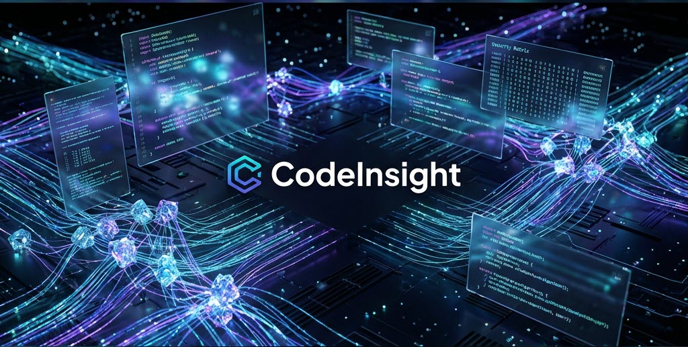

<p align="center">
  
</p>

# CodeInsight

CodeInsight acts as an on-demand, intelligent sidekick designed to run alongside your development workflow. As you build applications using tools like Cursor, CodeInsight offers a proactive "second pair of eyes" to identify and help resolve issues that aren't immediately apparent during the coding phase.

By orchestrating a swarm of specialized AI agents, the platform looks beyond the surface of your code to uncover hidden complexities. It empowers you to build with greater confidence by automatically detecting security risks, performance bottlenecks, and architectural inconsistencies in real-time—allowing you to fix problems as they arise, rather than waiting for them to surface later.

---

## Why CodeInsight: Project Moat

CodeInsight is built around capabilities that most AI code review tools do not offer in combination:

| Differentiator | What it means |
|----------------|----------------|
| **ACE Learning System** | The platform learns from every analysis. Skills are extracted from experiences, stored in a skillbook, and reused so the system gets better at *your* codebase over time—unlike stateless tools that forget after each run. |
| **Dynamic Role Selection** | An LLM chooses project-specific specialist roles from the architecture model instead of fixed agent types. The right “experts” are invented for each codebase and goal. |
| **Architecture-First Analysis** | An architecture model is built before any agent runs. Every agent gets project-wide context (modules, data flow, tech stack), so findings are grounded in structure, not isolated snippets. |
| **Multi-Model Budget Optimization** | Works with budget-friendly models (e.g. Qwen, DeepSeek, Kimi) via providers like Nano-GPT at a fraction of frontier-model cost, without sacrificing orchestration quality. |
| **Full Observability** | Langfuse integration for traces, cost tracking, and prompt effectiveness scoring so you can tune and debug the pipeline with real data. |

---

## Key Features

* **Durable native application workflow** — FastAPI submits directly to the SQLite-backed repository index, role planner, bounded scheduler, trusted specialist harness, verifier, correlation, coverage, and follow-up loop. LangGraph and LangChain are not normal runtime requirements.
* **Shared immutable repository index** — Each content/configuration snapshot is read once, stored by hash, and modeled in SQLite with files, symbols, imports, call edges, tests, ownership, and Git changes. Change-set analysis expands modified files through their dependency and call-graph neighborhood instead of rescanning for every specialist.
* **Evidence-gated native analysis** — Repository-specific roles execute through a trusted host allowlist, return strict typed proposals, and cannot promote claims directly. Immutable source spans are verified before candidates receive verdicts; accepted candidates are deterministically correlated, coverage gaps are recorded, and follow-up waves remain bounded by the durable run budget.
* **Multi-tier prompt caching** — Prompts are looked up in Langfuse → Redis → PostgreSQL; on miss, generated by LLM and cached in all three for reuse across runs.
* **Agent tool calling** — Agents can read files, list directories, and get file metadata within the project root, with path validation and configurable limits.
* **Token-aware chunking** — Large codebases are split by strategy (NONE, STANDARD, AGGRESSIVE); chunks are analyzed in parallel and synthesized into a single report.
* **Optional dynamic file selection** — Per-role file selection so each agent focuses on the most relevant files.
* **Previous-report comparison** — Load a prior analysis so the synthesis report includes “Progress Since Last” and trend-aware guidance.
* **FastAPI review workspace** — Submit, recover, inspect, and cancel durable analyses while viewing stages, waves, roles, task state, coverage gaps, accepted/rejected evidence-backed findings, and available model token/cost usage.

---

## 📺 OpenCode Demo: The Future of Agentic Coding

> "Moving from single-agent bottlenecks to high-performance modular orchestration."

Learn how to build a scalable, modular agent system in under 15 minutes. This walkthrough demonstrates how to orchestrate multiple specialized agents to handle complex logic, debugging, and documentation in parallel.

<p align="center">
  <a href="https://www.youtube.com/watch?v=ACodUPEYzrM">
    
  </a>
</p>

### ⚡ **The Speed-Run Summary**

* **🧩 Modular Orchestration**: Transition from a single heavy agent to a "Lead Architect" that delegates to specialized sub-agents (Reviewers, Testers, Docs).
* **🛠️ Hybrid Configuration**: Effortlessly configure agents using **JSON** or **Markdown** to define roles, models, and toolsets.
* **🤖 Multi-Model Swarms**: Seamlessly mix Claude 3.5, Gemini 1.5, and GPT-4o in a single workflow optimized for task complexity.
* *🧠 Solving Context Limits**: Leverage delegation to prevent "context bloat," keeping agents hyper-focused on large codebases.*

---

## 🛠️ Language coverage

CodeInsight recognizes 30 language families, but analysis depth is not yet
uniform. Python has AST parsing; JavaScript and TypeScript have dependency
heuristics; the remaining languages currently have discovery and text-level
analysis only. The modernization roadmap defines the path to native parsers and
analyzers without overstating current support.

## Getting Started

### Prerequisites

* Python 3.12 or 3.13
* [uv](https://docs.astral.sh/uv/)
* Docker only when you choose to self-host the optional Langfuse service

### Canonical installation with uv

`uv` now owns Python selection, dependency resolution, the environment, and the
lockfile:

```bash
uv sync --dev --locked
```

Copy `.env.example` to `.env`. Set `CODEINSIGHT_MODEL_BASE_URL` and
`CODEINSIGHT_DEFAULT_MODEL` for an OpenAI-compatible local endpoint such as LM
Studio. With no provider URL, CodeInsight runs truthfully in deterministic
index-only mode: snapshots and coverage are durable, but no model-generated
finding is presented.

Langfuse is optional: install it with `uv sync --extra observability`, then set
`CODEINSIGHT_LANGFUSE_ENABLED=true` and credentials. Export is asynchronous,
redacted by default, and never required for run success. The inactive legacy
engine can temporarily be installed with `uv sync --extra legacy`; it is not
used by FastAPI.

Optional local infrastructure and application storage:

```bash
docker compose -f infrastructure/observability/langfuse_stack/docker-compose.yml up -d
uv run python infrastructure/scripts/init_database.py
```

Normal local analysis uses one SQLite database in WAL mode and does not require
Docker. By default it is created in the platform user-data directory as
`codeinsight.db`; set `CODEINSIGHT_DATABASE_PATH` to use a portable or test
location. `infrastructure/db/database.py` is the single source for connection
pragmas, schema creation, and in-place versioned upgrades.

### Start CodeInsight

FastAPI hosts both the API and the new frontend:

```bash
uv run uvicorn api.app:app --host 127.0.0.1 --port 8000 --reload
```

Open `http://127.0.0.1:8000`; API documentation is at `/api/docs`. The
frontend submits real jobs to the native durable analysis engine and shows
their lifecycle, specialist plan, evidence, findings, coverage, and usage.

FastAPI is the only supported application entry point. The retired Streamlit
UI and pip-based setup scripts are no longer included; use `uv` for every
Python command so the checked-in lockfile remains authoritative.

### Tests

```bash
uv run pytest
```

## Responsibility-based package layout

The structural foundation separates product responsibilities while preserving
the existing runtime behavior:

| Package | Responsibility |
| --- | --- |
| `api/` | FastAPI routes, request/response schemas, and web delivery |
| `application/` | Analysis run coordination and application use cases |
| `domain/` | Framework-neutral architecture, collaboration, experience, and skill models |
| `indexing/` | Repository scanning and dependency discovery |
| `analysis/` | Specialist agents, prompts, chunking, and report generation |
| `workflow/` | Native durable scheduling and temporary lazy-loaded legacy choreography |
| `infrastructure/` | LLM, persistence, configuration, utilities, scripts, and optional Langfuse services |
| `web/` | Browser UI assets |
| `tests/` | API and application behavior tests |

Legacy top-level import packages remain as thin compatibility adapters during
the migration. New internal code should import from the responsibility-based
packages directly.

## Acknowledgments

**Democratizing AI Development.** One of the biggest barriers to innovation is the cost of compute. CodeInsight exists today largely because of [Nano-GPT](https://nano-gpt.com), a platform that provides access to high-performance open-source models at a fraction of the usual cost.

We believe powerful AI tools should be accessible to everyone—students, hobbyists, and startups alike—without breaking the bank. If you're looking to power your own projects with affordable, high-quality API endpoints, you can get started here:

👉 **[Get Access to Nano-GPT](https://nano-gpt.com/invite/ck3mnXrF)**

## License

This project is licensed under the MIT License - see the [LICENSE](LICENSE) file for details.

## Contributing

1. Fork the repository
2. Create your feature branch (`git checkout -b feature/amazing-feature`)
3. Commit your changes (`git commit -m 'Add some amazing feature'`)
4. Push to the branch (`git push origin feature/amazing-feature`)
5. Open a Pull Request
