# CodeInsight Architecture Documentation

**Document Version:** 1.0  
**Last Updated:** December 9, 2025  
**Status:** Current Implementation

## Table of Contents

1. [Introduction](#introduction)
2. [High-Level Architecture](#high-level-architecture)
3. [Component Architecture](#component-architecture)
4. [Swarm Analysis Workflow](#swarm-analysis-workflow)
5. [Data Flow Architecture](#data-flow-architecture)
6. [Storage Architecture](#storage-architecture)
7. [Integration Points](#integration-points)
8. [State Management](#state-management)
9. [Error Handling](#error-handling)

---

## Introduction

CodeInsight is a comprehensive code analysis platform that uses a **Swarm Analysis architecture** with LangGraph workflows for intelligent multi-agent code analysis. Unlike v2's individual agent classes, v3 employs a workflow-based approach where specialized analysis roles are dynamically selected, prompts are generated contextually, and agents execute in parallel to provide comprehensive code analysis.

### Key Architectural Decisions

- **Workflow-Based Architecture**: Uses LangGraph for orchestration instead of individual agent classes
- **Dynamic Role Selection**: LLM determines relevant analysis roles based on architecture
- **Context-Aware Prompts**: Prompts are generated dynamically for each role, not loaded from templates
- **Experience Learning**: System learns from past analyses to improve future performance
- **Unified Scanner Factory**: All components use `create_project_scanner()` for consistent language-agnostic configuration
- **PostgreSQL + Redis**: All persistent storage uses PostgreSQL with Redis caching layer
- **Langfuse Integration**: All LLM calls are tracked through LangGraph's Langfuse integration

### Multi-Language Support

All components support multiple programming languages including Python, JavaScript, TypeScript, Java, Go, Rust, C/C++, Ruby, PHP, and more. Languages can be auto-detected or manually selected.

---

## High-Level Architecture

The system is organized into distinct layers: User Interface, Orchestration, Workflow Execution, LLM Integration, and Storage.

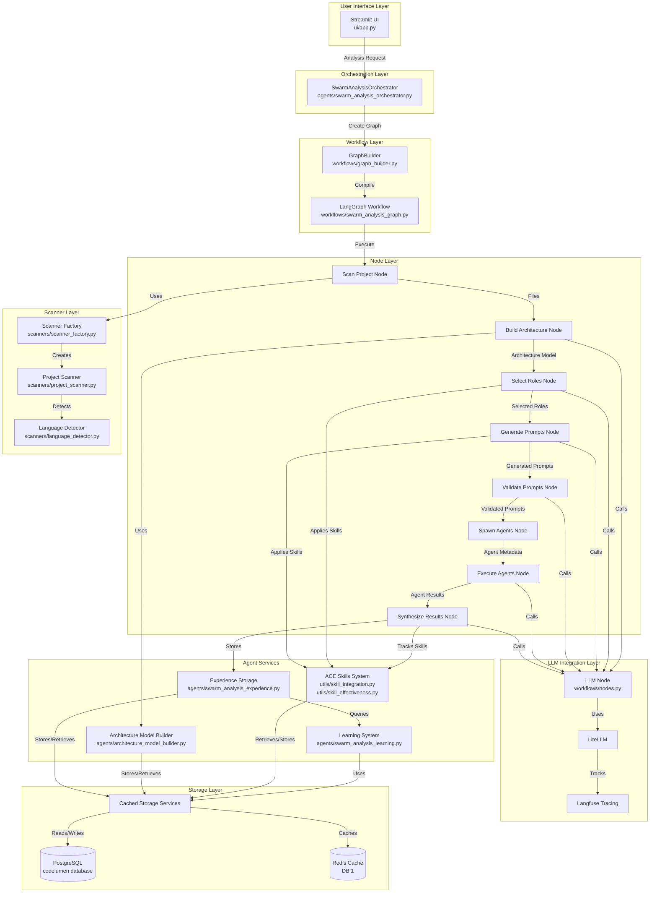

---

## Component Architecture

### Orchestration Layer

#### SwarmAnalysisOrchestrator

**Location**: [`agents/swarm_analysis_orchestrator.py`](agents/swarm_analysis_orchestrator.py)

The main orchestrator class that provides a v2-compatible interface while using LangGraph internally.

**Key Responsibilities:**

- Wraps LangGraph workflow for backward compatibility
- Prepares initial state from user parameters
- Handles streaming callbacks for real-time updates
- Extracts results in v2-compatible format
- Manages error states gracefully

**Key Methods:**

- `analyze()`: Main entry point for swarm analysis
- `_extract_results()`: Converts final state to v2-compatible format

### Workflow Layer

#### GraphBuilder

**Location**: [`workflows/graph_builder.py`](workflows/graph_builder.py)

Factory class for creating LangGraph workflows with automatic Langfuse integration.

**Key Features:**

- Creates StateGraph from nodes and edges
- Injects Langfuse callbacks via config
- Supports checkpointing for state persistence
- Handles trace correlation (user_id, session_id)

#### Swarm Analysis Graph

**Location**: [`workflows/swarm_analysis_graph.py`](workflows/swarm_analysis_graph.py)

Defines the complete Swarm Analysis workflow with all nodes and edges.

**Workflow Nodes:**

1. `scan_project` - Scans project files and detects languages
2. `build_architecture` - Builds or retrieves architecture model
3. `load_previous_reports` - Loads previous reports for comparison (optional)
4. `select_roles` - Selects relevant analysis roles via LLM
5. `dispatch_prompt_generation` - Dispatches parallel prompt generation
6. `generate_single_prompt` - Generates prompt for one role (parallel execution)
7. `collect_generated_prompts` - Collects parallel prompt results
8. `dispatch_prompt_validation` - Dispatches parallel prompt validation
9. `validate_single_prompt` - Validates one prompt (parallel execution)
10. `collect_validation_results` - Collects parallel validation results
11. `store_prompts` - Stores prompts in database
12. `spawn_agents` - Creates agent metadata for each role
13. `dispatch_agents` - Dispatches parallel agent execution
14. `select_agent_files` - Selects files for one agent (optional, parallel execution)
15. `execute_single_agent` - Executes one agent analysis (parallel execution)
16. `collect_agent_results` - Collects parallel agent results
17. `synthesize_results` - Synthesizes results into unified report

### Node Layer

#### Workflow Nodes

**Location**: [`workflows/swarm_analysis/`](workflows/swarm_analysis/) (with [`workflows/swarm_analysis_nodes.py`](workflows/swarm_analysis_nodes.py) kept as a backward-compatibility wrapper)

Each node (and supporting functions) implements a specific stage of the swarm analysis pipeline and is organized by domain within the `workflows/swarm_analysis/` package.

**Node Details:**

1. **scan_project_node**
   - Scans project directory using `create_project_scanner()`
   - Detects programming languages if auto-detect is enabled
   - Computes file hash for caching
   - Returns files list and detected languages

2. **build_architecture_node**
   - Uses `ArchitectureModelBuilder` to build or retrieve the architecture model
   - Checks cache first using file hash
   - Stores architecture model in knowledge base
   - Returns architecture model dictionary

3. **load_previous_reports_node**
   - Loads previous analysis reports from file path or scan history
   - Parses structured findings for comparison
   - **ACE Phase 2**: Pre-fetches all relevant skills based on architecture type and goal
   - Stores skills in `state.learned_skills` for use by subsequent nodes
   - Optional: Safe to run even when no previous report is configured
   - Returns previous report text, parsed findings, and pre-fetched skills

4. **select_roles_node**
   - Uses LLM to propose relevant roles based on architecture and goal
   - **ACE Phase 1**: Applies role selection skills from `state.learned_skills` to guide role selection
   - Skills are formatted and injected into the role selection prompt
   - Validates roles against `RoleEnum` and security-focused validators in `workflows/swarm_analysis_roles.py`
   - Rejects suspicious or malformed role names and returns only safe, validated roles

5. **Prompt Generation (Dispatch/Collect Pattern)**
   - **dispatch_prompt_generation_node**: Dispatches parallel prompt generation tasks using LangGraph Send
   - **generate_single_prompt_node**: Generates context-specific prompt for one role via LLM (executes in parallel)
     - **ACE Phase 1**: Applies prompt generation skills from `state.learned_skills` to improve prompt quality
     - Skills are formatted and injected into the prompt generation context
   - **collect_generated_prompts_node**: Collects and aggregates parallel prompt results
   - Uses architecture model and goal for context
   - Returns dictionary mapping `role_name -> prompt_content`

6. **Prompt Validation (Dispatch/Collect Pattern)**
   - **dispatch_prompt_validation_node**: Dispatches parallel prompt validation tasks using LangGraph Send
   - **validate_single_prompt_node**: Validates one generated prompt via LLM evaluation (executes in parallel)
   - **collect_validation_results_node**: Collects and aggregates parallel validation results
   - Returns validation results with scores (confidence, clarity, completeness, relevance, actionability, accuracy)

7. **store_prompts_node**
   - Stores generated prompts and validation results in database
   - Enables prompt reuse and learning from effective prompts
   - Tracks prompt quality metrics over time

8. **spawn_agents_node**
   - Creates agent metadata for each role (including prompt, role name, and architecture context)
   - Returns list of agent info dictionaries

9. **Agent Execution (Dispatch/Collect Pattern)**
   - **dispatch_agents_node**: Dispatches parallel agent execution tasks using LangGraph Send
   - **select_agent_files_node**: Optionally selects relevant files for one agent (executes in parallel when enabled)
   - **execute_single_agent_node**: Executes one agent's analysis via LLM with tool-calling support (executes in parallel)
   - **collect_agent_results_node**: Collects and aggregates parallel agent results
   - Processes files in chunks based on token limits
   - Routes file access requests either to embedded tools or to the MCP filesystem server (when available)
   - Returns agent results dictionary and chunk-level metrics

10. **synthesize_results_node**

- Synthesizes all agent results into unified report via LLM
- **ACE Phase 2**: Applies synthesis skills from `state.learned_skills` to improve report quality
- **ACE Phase 3**: Tracks skill usage and calculates effectiveness after synthesis completes
- Updates skill statistics (usage_count, success_rate) in database
- Stores experience for learning
- Returns final synthesized report

#### Parallel Execution Architecture

The Swarm Analysis workflow uses LangGraph's `Send` mechanism for true parallel execution of independent tasks. This enables multiple agents, prompts, and validations to run concurrently, significantly improving performance.

**LangGraph Send Mechanism**:

- Send payloads **REPLACE** the state for target nodes (not merged)
- All required fields must be explicitly included in Send payloads
- Previous state is not automatically available to parallel nodes
- See `docs/issues/CRITICAL_BUG_FIX_LANGGRAPH_SEND_STATE.md` for critical implementation details

**Dispatch/Collect Pattern**:

1. **Dispatch Node**: Creates `Send` commands for parallel execution
2. **Parallel Execution Nodes**: Execute independently via `Send`
3. **Collection Node**: Aggregates results using reducer patterns

**State Aggregation**: Parallel nodes use `Annotated[List, operator.add]` reducers for safe concurrent updates, which are then converted to dictionaries by collection nodes.

#### LLM Node and Tool Calling

**Location**: [`workflows/nodes.py`](workflows/nodes.py)

Central LLM integration point that ensures all LLM calls go through Langfuse tracking.

**Key Features:**

- Uses LiteLLM for model calls
- LangChain-compatible wrapper for Langfuse integration
- Supports multiple message formats
- Automatic Langfuse observation creation

### Scanner Layer

#### Scanner Factory

**Location**: [`scanners/scanner_factory.py`](scanners/scanner_factory.py)

Unified factory function for creating ProjectScanner instances with consistent configuration.

**Key Features:**

- Single source of truth for scanner initialization
- Language-agnostic configuration
- Supports config defaults and UI overrides
- Ensures all components use same language settings

#### Project Scanner

**Location**: [`scanners/project_scanner.py`](scanners/project_scanner.py)

Scans project directories and extracts file information.

**Key Features:**

- Recursive directory scanning
- File extension filtering
- Language detection support
- Returns FileInfo objects with metadata

### Agent Services

#### Architecture Model Builder

**Location**: [`agents/architecture_model_builder.py`](agents/architecture_model_builder.py)

Builds architecture models from codebases using LLM analysis.

**Key Features:**

- Extracts system structure and organization
- Identifies modules, components, and dependencies
- Detects design patterns and anti-patterns
- Caches models using file hash
- Returns Pydantic ArchitectureModel objects

#### Experience Storage

**Location**: [`agents/swarm_analysis_experience.py`](agents/swarm_analysis_experience.py)

Manages storage and retrieval of swarm analysis experiences for learning.

**Key Functions:**

- `create_swarm_experience()`: Creates Experience object from results
- `store_swarm_experience()`: Stores experience in database

#### Learning System

**Location**: [`agents/swarm_analysis_learning.py`](agents/swarm_analysis_learning.py)

Retrieves and extracts learnings from past experiences.

**Key Functions:**

- `retrieve_relevant_experiences()`: Queries past experiences
- `extract_learnings_from_experiences()`: Extracts patterns and insights
- `get_learned_skills_for_analysis()`: Gets skills to inform current analysis

### ACE Skills System

**Status**: Fully Implemented (Phases 1-3)  
**Location**: `utils/skill_integration.py`, `utils/skill_effectiveness.py`, `utils/swarm_skillbook.py`, `services/storage/swarm_skillbook_storage.py`

The ACE (Agent Capability Enhancement) Skills System enables continuous learning by extracting, storing, retrieving, and applying learned patterns from past analyses. The system implements a complete learning loop that improves analysis quality over time.

#### Overview

The ACE Skills System operates through a three-phase learning loop:

1. **Phase 1: Skill Application** - Skills are retrieved and applied in role selection and prompt generation nodes
2. **Phase 2: Early Skill Retrieval** - Skills are pre-fetched early in the workflow and applied in synthesis
3. **Phase 3: Skill Tracking** - Skill usage and effectiveness are tracked after analysis completes

#### Architecture Flow

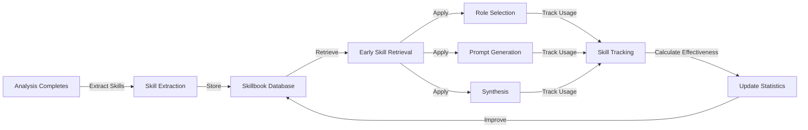

#### Three-Phase Implementation

**Phase 1: Skill Application**

Skills are retrieved and applied in workflow nodes to improve analysis quality:

- **Role Selection** (`select_roles_node`): Applies role selection skills to guide LLM in selecting relevant analysis roles
- **Prompt Generation** (`generate_single_prompt_node`): Applies prompt generation skills to improve prompt quality

Skills are formatted using `format_skills_for_prompt()` and `format_harmful_patterns()` utilities from `utils/skill_integration.py` and injected into LLM prompts.

**Phase 2: Early Skill Retrieval**

Skills are pre-fetched in `load_previous_reports_node` and stored in `state.learned_skills` for use by all subsequent nodes:

- **Pre-fetching**: All relevant skills retrieved based on architecture type and goal
- **State Storage**: Skills stored as dictionaries in state for workflow-wide access
- **Synthesis Integration**: Synthesis skills applied in `synthesize_results_node` to improve report quality

This optimization reduces redundant database queries and ensures skills are available throughout the workflow.

**Phase 3: Skill Tracking**

After analysis completes, skill usage and effectiveness are tracked:

- **Usage Tracking**: All skills from `state.learned_skills` are tracked
- **Effectiveness Calculation**: Skill effectiveness calculated based on analysis quality metrics using `utils/skill_effectiveness.py`
- **Statistics Update**: Skill usage count and success rate updated in database via `update_skill_usage()`

Effectiveness calculation is skill-type-specific:

- **role_selection**: Based on agent success rate and report quality
- **prompt_generation**: Based on evaluation results and validation scores
- **synthesis**: Based on report quality metrics and agent results

#### Skill Types and Categories

**Skill Types:**

- `role_selection`: Patterns for selecting analysis roles
- `prompt_generation`: Patterns for generating effective prompts
- `synthesis`: Patterns for synthesizing agent results

**Skill Categories:**

- `helpful`: Skills that improve analysis quality (normal effectiveness scoring)
- `harmful`: Skills that should be avoided (inverted effectiveness scoring)
- `neutral`: Skills with neutral impact

#### Integration Points

**Skill Retrieval:**

- `utils/swarm_skillbook.get_relevant_skills()`: Retrieves skills by architecture type and goal
- Returns dictionary mapping `skill_type -> List[SwarmSkill]`

**Skill Formatting:**

- `utils/skill_integration.format_skills_for_prompt()`: Formats helpful skills for prompt inclusion
- `utils/skill_integration.format_harmful_patterns()`: Formats harmful skills as warnings

**Skill Tracking:**

- `utils/skill_effectiveness.calculate_skill_effectiveness()`: Calculates effectiveness score
- `utils/swarm_skillbook.update_skill_usage()`: Updates skill statistics in database

**Storage:**

- Skills stored in PostgreSQL `swarm_skillbook` table
- Cached in Redis with 12-hour TTL
- Storage service: `services/storage/swarm_skillbook_storage.py`

#### Non-Blocking Design

All skill operations are non-blocking:

- Skill retrieval failures are logged but don't stop analysis
- Skill application failures fall back to analysis without skills
- Skill tracking failures don't prevent analysis completion

This ensures graceful degradation and maintains system reliability.

---

## Swarm Analysis Workflow

The Swarm Analysis workflow processes code analysis through multiple stages, using parallel execution for independent tasks (prompt generation, validation, and agent execution) to improve performance.

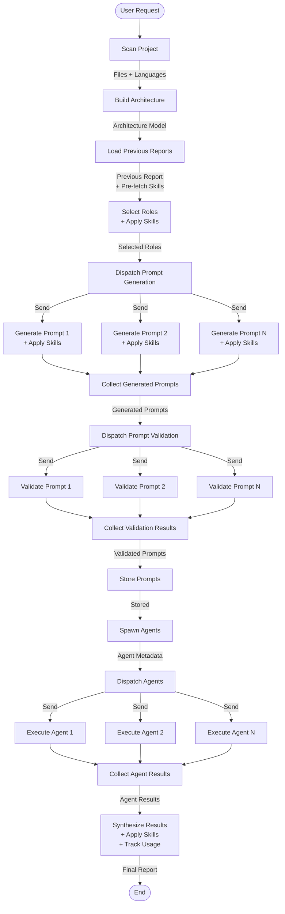

### Workflow State Flow

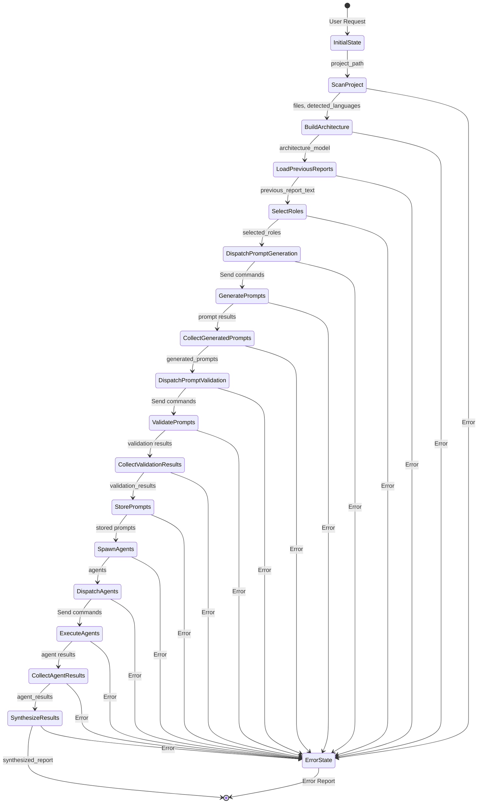

### Detailed Node Interactions

```mermaid
sequenceDiagram
    participant User
    participant Orchestrator as SwarmAnalysisOrchestrator
    participant Graph as LangGraph Workflow
    participant ScanNode as Scan Project Node
    participant ArchNode as Build Architecture Node
    participant LoadPrevNode as Load Previous Reports Node
    participant RolesNode as Select Roles Node
    participant DispatchPrompts as Dispatch Prompt Generation
    participant GenPrompt as Generate Single Prompt (Parallel)
    participant CollectPrompts as Collect Generated Prompts
    participant DispatchValidate as Dispatch Prompt Validation
    participant ValPrompt as Validate Single Prompt (Parallel)
    participant CollectValidate as Collect Validation Results
    participant StorePromptsNode as Store Prompts Node
    participant SpawnNode as Spawn Agents Node
    participant DispatchAgents as Dispatch Agents Node
    participant ExecAgent as Execute Single Agent (Parallel)
    participant CollectResults as Collect Agent Results
    participant SynthesizeNode as Synthesize Results Node
    participant Storage as Storage Services
    
    User->>Orchestrator: analyze(project_path, goal, ...)
    Orchestrator->>Graph: invoke(initial_state, config)
    
    Graph->>ScanNode: scan_project_node(state)
    ScanNode-->>Graph: state with files, detected_languages
    
    Graph->>ArchNode: build_architecture_node(state)
    ArchNode->>Storage: Store/retrieve architecture model
    Storage-->>ArchNode: Architecture model
    ArchNode-->>Graph: state with architecture_model
    
    Graph->>LoadPrevNode: load_previous_reports_node(state)
    LoadPrevNode->>Storage: Pre-fetch relevant skills
    Storage-->>LoadPrevNode: Skills by type
    LoadPrevNode-->>Graph: state with previous_report_text + learned_skills
    
    Graph->>RolesNode: select_roles_node(state)
    RolesNode->>RolesNode: Apply role selection skills
    RolesNode-->>Graph: state with selected_roles

##### Prompt Generation (`prompt_generation/`):
- **Parallel Execution**: Uses `dispatch_prompt_generation_node` to fan out to `generate_single_prompt_node` for each selected role.
- **Workflow**:
    1.  **Check Langfuse**: Queries Langfuse for existing prompts matching `role`, `architecture_hash`, and `file_hash`.
    2.  **Check Cache**: Checks Redis/In-memory cache for matching prompts.
    3.  **Check CodeLumen DB (Fallback)**: Checks local `codelumen` database for prompts matching `architecture_hash`.
    4.  **Generation (LLM)**: If all checks fail, generates a new prompt using `llm_node`.
        *   **Validation (Step 4 Only)**: Newly generated prompts are validated by `PromptValidator` (checks strictness, references). Cached/stored prompts bypass validation for performance.
        *   **Filtering**: Removes hardcoded technologies via `PromptTechnologyFilter`.
- **Output**: Aggregates generated prompts and stores IDs for observability.
    
    Graph->>DispatchPrompts: dispatch_prompt_generation_node(state)
    DispatchPrompts->>GenPrompt: Send(role1)
    DispatchPrompts->>GenPrompt: Send(role2)
    DispatchPrompts->>GenPrompt: Send(roleN)
    par Parallel Execution
        GenPrompt->>GenPrompt: Apply prompt generation skills
        GenPrompt-->>Graph: prompt1
        GenPrompt->>GenPrompt: Apply prompt generation skills
        GenPrompt-->>Graph: prompt2
        GenPrompt->>GenPrompt: Apply prompt generation skills
        GenPrompt-->>Graph: promptN
    end
    Graph->>CollectPrompts: collect_generated_prompts_node(state)
    CollectPrompts-->>Graph: state with generated_prompts
    
    Graph->>DispatchValidate: dispatch_prompt_validation_node(state)
    DispatchValidate->>ValPrompt: Send(prompt1)
    DispatchValidate->>ValPrompt: Send(prompt2)
    DispatchValidate->>ValPrompt: Send(promptN)
    par Parallel Execution
        ValPrompt-->>Graph: validation1
        ValPrompt-->>Graph: validation2
        ValPrompt-->>Graph: validationN
    end
    Graph->>CollectValidate: collect_validation_results_node(state)
    CollectValidate-->>Graph: state with validation_results
    
    Graph->>StorePromptsNode: store_prompts_node(state)
    StorePromptsNode-->>Graph: state updated
    
    Graph->>SpawnNode: spawn_agents_node(state)
    SpawnNode-->>Graph: state with agents
    
    Graph->>DispatchAgents: dispatch_agents_node(state)
    DispatchAgents->>ExecAgent: Send(agent1)
    DispatchAgents->>ExecAgent: Send(agent2)
    DispatchAgents->>ExecAgent: Send(agentN)
    par Parallel Execution
        ExecAgent-->>Graph: result1
        ExecAgent-->>Graph: result2
        ExecAgent-->>Graph: resultN
    end
    Graph->>CollectResults: collect_agent_results_node(state)
    CollectResults-->>Graph: state with agent_results
    
    Graph->>SynthesizeNode: synthesize_results_node(state)
    SynthesizeNode->>SynthesizeNode: Apply synthesis skills
    SynthesizeNode->>Storage: Store experience
    SynthesizeNode->>SynthesizeNode: Track skill usage & effectiveness
    SynthesizeNode->>Storage: Update skill statistics
    SynthesizeNode-->>Graph: state with synthesized_report
    
    Graph-->>Orchestrator: final_state
    Orchestrator-->>User: result dictionary
```

---

## Data Flow Architecture

### Request Flow

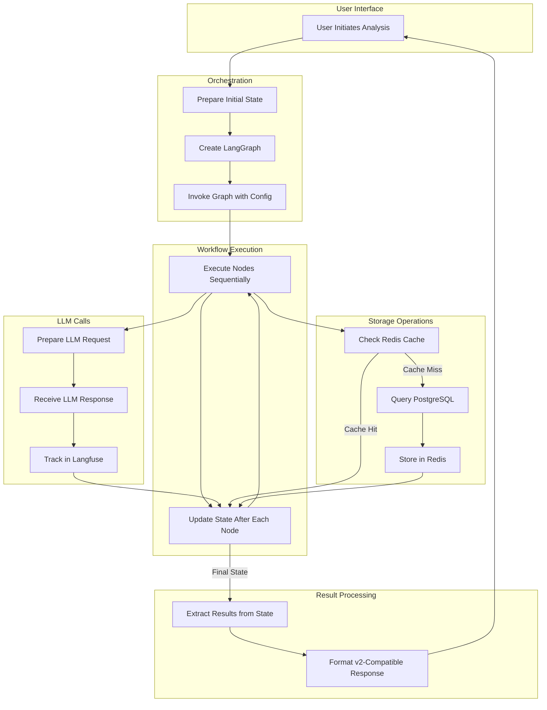

### State Flow Through Nodes

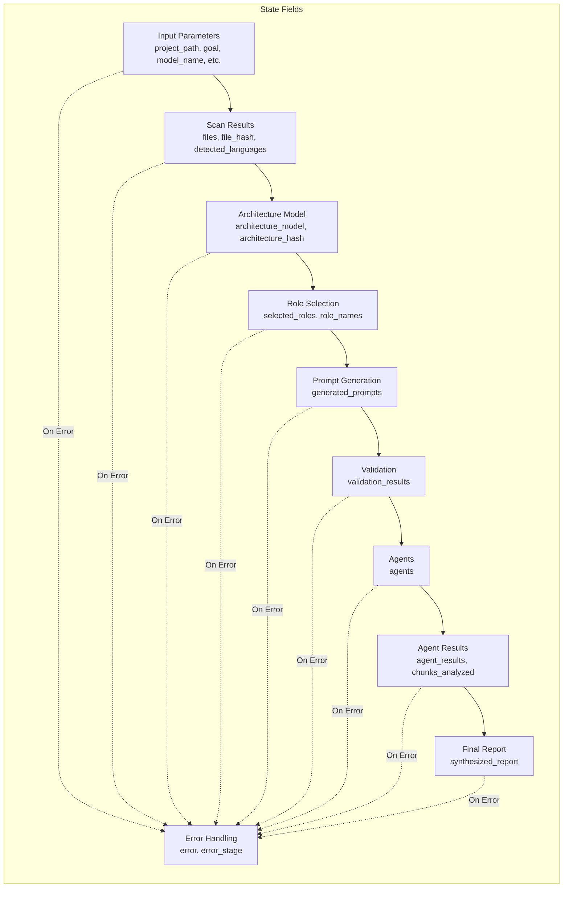

---

## Storage Architecture

CodeInsight uses a two-tier storage architecture: PostgreSQL for persistent storage and Redis for caching. This architecture was migrated from DuckDB to PostgreSQL, providing better scalability, reliability, and feature support.

### Architecture Overview

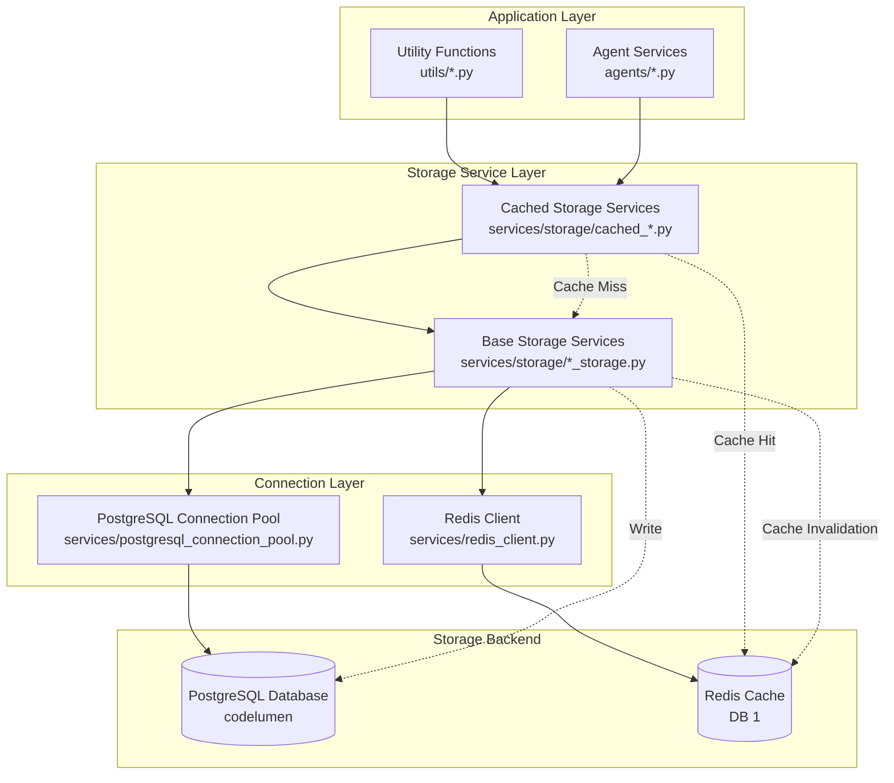

### Architecture Components

#### Database Layer

**PostgreSQL Database: `codelumen`**

- All structured data is stored in PostgreSQL
- Database: `codelumen`
- Schema: `CodeLumen`
- Connection pooling via `services/postgresql_connection_pool.py`

**Storage Services:**

- `services/storage/scan_history_storage.py` - Scan history storage
- `services/storage/experience_storage.py` - Agent experience storage
- `services/storage/knowledge_storage.py` - Knowledge base storage
- `services/storage/swarm_skillbook_storage.py` - Swarm skillbook storage
- `services/storage/prompt_storage.py` - Prompt storage
- `services/storage/architecture_model_storage.py` - Architecture model storage

#### Caching Layer

**Redis Cache (DB 1)**

- Key prefix: `CodeLumen:`
- TTL-based expiration
- Cache invalidation on writes
- Cache wrapper pattern via `services/cache_decorators.py`

**Cached Storage Services:**

- `services/storage/cached_scan_history_storage.py`
- `services/storage/cached_experience_storage.py`
- `services/storage/cached_knowledge_storage.py`
- `services/storage/cached_swarm_skillbook_storage.py`
- `services/storage/cached_prompt_storage.py`
- `services/storage/cached_architecture_model_storage.py`

#### Utility Layer

**Utility Modules:**

- `utils/scan_history.py` - Scan history API
- `utils/experience_storage.py` - Experience storage API
- `utils/knowledge_base.py` - Knowledge base API
- `utils/swarm_skillbook.py` - Swarm skillbook API
- `utils/prompt_storage.py` - Prompt storage API

These modules provide backward-compatible APIs that use the cached storage services.

### Data Flow

#### Write Operations

1. Client calls utility function (e.g., `utils/scan_history.py::save_scan()`)
2. Utility function calls cached storage service
3. Cached storage service:
   - Writes to PostgreSQL
   - Invalidates relevant cache keys
   - Returns result

#### Read Operations

1. Client calls utility function (e.g., `utils/scan_history.py::get_scan_by_id()`)
2. Utility function calls cached storage service
3. Cached storage service:
   - Checks Redis cache first
   - If cache miss, reads from PostgreSQL
   - Stores result in cache with TTL
   - Returns result

### Storage Service Hierarchy

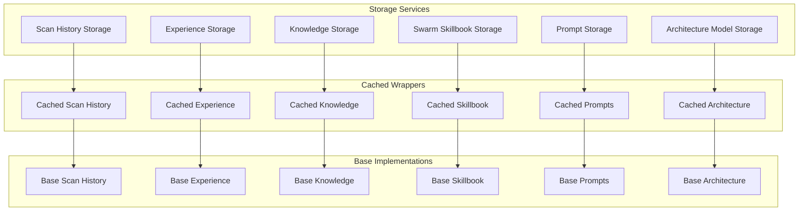

### Connection Pooling

**PostgreSQL Connection Pool:**

- Managed by `services/postgresql_connection_pool.py`
- Thread-safe singleton pattern
- Supports read-only and read-write connections
- Automatic connection reuse

**Redis Connection:**

- Managed by `services/redis_client.py`
- Connection pooling via redis-py
- Automatic reconnection on failure

### Cache Strategy

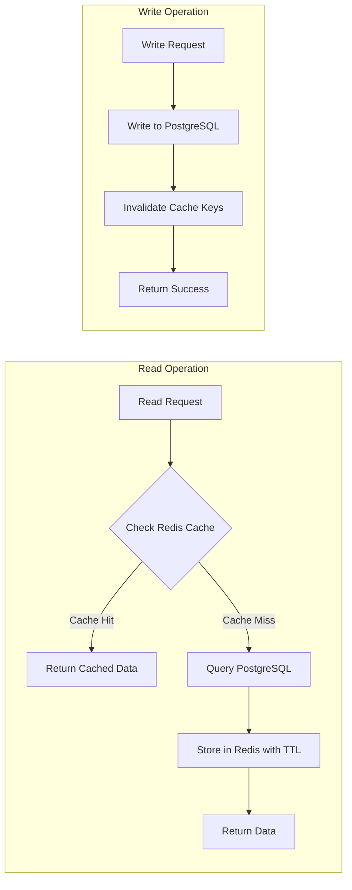

#### Cache Key Naming

Format: `CodeLumen:{service}:{type}:{id}` (prefix retained for backward compatibility)

Examples:

- `CodeLumen:scan_history:123`
- `CodeLumen:experience:{experience_id}`
- `CodeLumen:knowledge:{knowledge_id}`
- `CodeLumen:prompt:{prompt_id}`

#### TTL Values

- Scan history: 1 hour
- Experiences: 1 hour
- Knowledge base: 6 hours (24 hours for architecture models)
- Swarm skillbook: 12 hours
- Prompts: 12 hours

#### Cache Invalidation

- On write: Invalidate specific item cache
- On delete: Invalidate specific item cache
- On update: Invalidate specific item cache and related query caches
- TTL expiration: Automatic via Redis

### Database Schema

**PostgreSQL Database:** `codelumen`  
**Schema:** `CodeLumen`

#### CodeInsight Schema

All tables are in the `CodeLumen` schema (database name and schema are preserved for backward compatibility):

**Key Tables:**

- `scan_history` - Analysis scan results
- `metrics_history` - Metrics over time
- `analysis_metrics` - Metrics linked to scans
- `experiences` - Agent experiences
- `knowledge_base` - Shared knowledge
- `swarm_skillbook` - Swarm skills and patterns (ACE Skills System)
- `skill_usage_history` - Skill usage tracking (ACE Skills System)
- `prompts` - Prompt library
- `architecture_models` - Architecture models

#### Indexes

Indexes are created for:

- Primary keys (automatic)
- Foreign keys
- Frequently queried columns
- Full-text search (GIN indexes for JSONB)
- Composite indexes for common query patterns

See `scripts/schema/create_indexes.sql` for all indexes.

### Swarm Skillbook Storage

**Location**: [`services/storage/swarm_skillbook_storage.py`](services/storage/swarm_skillbook_storage.py), [`services/storage/cached_swarm_skillbook_storage.py`](services/storage/cached_swarm_skillbook_storage.py)

The Swarm Skillbook Storage manages the ACE Skills System data:

**Key Functions:**

- `save_skill()`: Stores a new skill or updates existing skill
- `get_skills()`: Retrieves skills with optional filtering (skill_type, skill_category, context)
- `get_relevant_skills()`: Retrieves skills organized by type based on architecture type and goal
- `update_skill_usage()`: Updates skill usage statistics (usage_count, success_rate) after analysis

**Storage Structure:**

- **swarm_skillbook table**: Stores skill definitions (skill_id, skill_type, skill_category, content, context, confidence, usage_count, success_rate)
- **skill_usage_history table**: Tracks skill usage per analysis (skill_id, analysis_id, effectiveness, timestamp)

**Caching Strategy:**

- Skills cached in Redis with 12-hour TTL
- Cache key format: `CodeLumen:skillbook:skill:{skill_id}`
- Relevant skills queries cached by architecture type and goal
- Cache invalidation on skill updates

**Integration:**

- Utility API: `utils/swarm_skillbook.py` provides backward-compatible functions
- Used by workflow nodes for skill retrieval and tracking
- Non-blocking: failures don't prevent analysis completion

### Error Handling

- All storage operations include try/except blocks
- Errors are logged with full stack traces
- Failures return None or empty collections (never raise exceptions to callers)
- Connection pool handles connection failures automatically

### Performance Optimizations

#### Query Optimization

- Use indexes for all WHERE clauses
- Use prepared statements where beneficial
- Batch operations for bulk inserts
- JSONB for flexible schema storage

#### Caching Optimizations

- Cache popular queries
- Cache frequently accessed items
- Use appropriate TTL values
- Monitor cache hit rates

#### Connection Pooling

- Reuse connections
- Limit pool size appropriately
- Monitor connection usage

### Monitoring

#### Logging

- All operations are logged
- Error logs include stack traces
- Performance metrics logged for slow operations

#### Metrics

- Cache hit/miss rates
- Query execution times
- Connection pool usage
- Storage operation counts

### Migration Status

All migrations from DuckDB to PostgreSQL are complete:

- ✅ Phase 1: Scan History Migration
- ✅ Phase 2: Redis Caching Infrastructure
- ✅ Phase 3: Experience Storage Migration
- ✅ Phase 4: Knowledge Base Migration
- ✅ Phase 5: Swarm Services Migration
- ✅ Phase 6: Cleanup & Optimization

### Future Considerations

- Consider read replicas for scaling reads
- Consider partitioning for large tables
- Consider materialized views for complex queries
- Monitor and optimize slow queries
- Review and adjust cache TTL values based on usage patterns

---

## Integration Points

### LLM Integration

**Location**: [`workflows/nodes.py`](workflows/nodes.py)

All LLM calls go through the `llm_node()` function which:

- Uses LiteLLM for model abstraction
- Provides LangChain-compatible wrapper
- Automatically tracks calls in Langfuse
- Supports multiple model providers

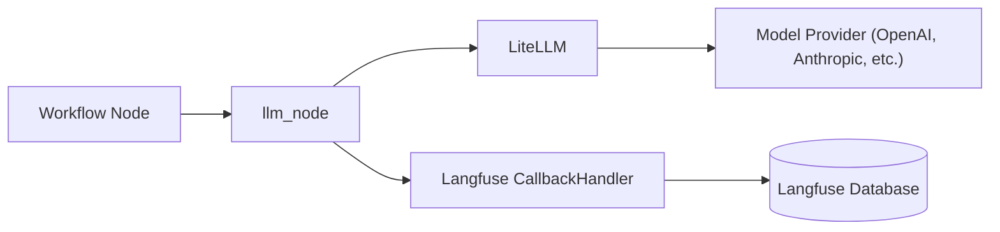

### Langfuse Integration

**Location**: [`workflows/integration.py`](workflows/integration.py), [`workflows/graph_builder.py`](workflows/graph_builder.py)

Langfuse integration is handled at the graph level:

- CallbackHandler is injected via config
- All LLM calls are automatically tracked
- Traces are correlated with user_id and session_id
- Observations are created with proper types (llm, chain)

### Scanner Integration

**Location**: [`scanners/scanner_factory.py`](scanners/scanner_factory.py)

All components use the unified `create_project_scanner()` factory:

- Ensures consistent language configuration
- Supports config defaults and UI overrides
- Language-agnostic design
- Used by orchestrator, nodes, and UI

### Storage Integration

**Location**: [`services/storage/`](services/storage/)

All storage operations use the cached storage pattern:

- Utility functions provide backward-compatible API
- Cached wrappers handle Redis caching
- Base services handle PostgreSQL operations
- Connection pooling for performance

---

## State Management

### State Schema

**Location**: [`workflows/swarm_analysis_state.py`](workflows/swarm_analysis_state.py)

The `SwarmAnalysisState` TypedDict defines all state fields:

```python
class SwarmAnalysisState(TypedDict):
    # Input parameters
    project_path: str
    goal: NotRequired[Optional[str]]
    model_name: NotRequired[str]
    max_agents: NotRequired[int]
    max_tokens_per_chunk: NotRequired[int]
    auto_detect_languages: NotRequired[Optional[bool]]
    file_extensions: NotRequired[Optional[List[str]]]
    
    # Project scanning
    files: NotRequired[List[Dict[str, Any]]]
    file_hash: NotRequired[Optional[str]]
    detected_languages: NotRequired[List[str]]
    
    # Architecture model
    architecture_model: NotRequired[Optional[Dict[str, Any]]]
    architecture_hash: NotRequired[Optional[str]]
    
    # Role selection
    selected_roles: NotRequired[List[Dict[str, Any]]]
    role_names: NotRequired[List[str]]
    
    # Prompt generation and validation
    generated_prompts: NotRequired[Dict[str, str]]
    validation_results: NotRequired[Dict[str, Dict[str, Any]]]
    
    # Agent execution
    agents: NotRequired[List[Any]]
    agent_results: NotRequired[Dict[str, Dict[str, Any]]]
    chunks_analyzed: NotRequired[int]
    
    # Result synthesis
    synthesized_report: NotRequired[Optional[str]]
    
    # Error handling
    error: NotRequired[Optional[str]]
    error_stage: NotRequired[Optional[str]]
    
    # Metadata
    metadata: NotRequired[Dict[str, Any]]
    stream_callback: NotRequired[Optional[Any]]
```

### State Flow Through Workflow

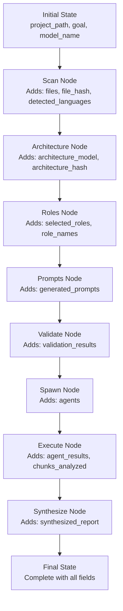

---

## Error Handling

### Error Propagation

Errors are handled at multiple levels:

1. **Node Level**: Each node catches exceptions and sets error state
2. **Workflow Level**: Workflow checks for errors and can route to error handler
3. **Orchestrator Level**: Orchestrator checks final state for errors and raises exceptions

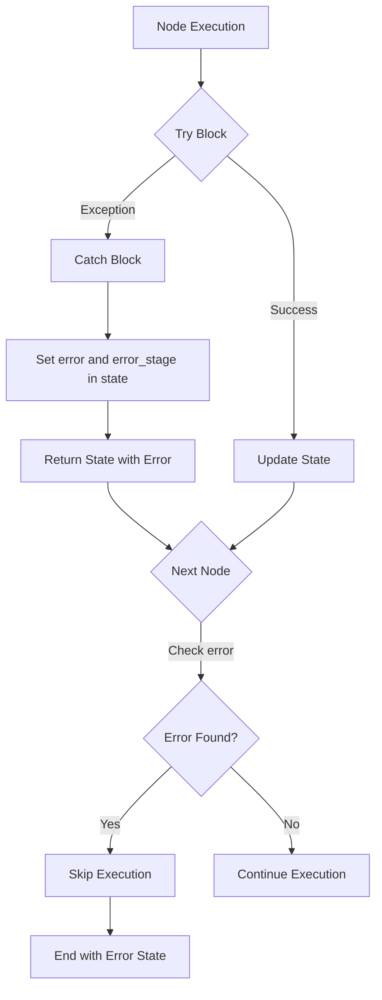

### Error State Structure

When an error occurs, the state includes:

- `error`: Error message string
- `error_stage`: Name of the node where error occurred

The orchestrator checks for these fields and raises exceptions if present.

### Error Recovery

Currently, errors stop workflow execution. Future enhancements could include:

- Retry logic for transient failures
- Fallback strategies for node failures
- Partial result recovery
- Error reporting in final results

---

## Summary

CodeInsight's architecture provides:

1. **Workflow-Based Analysis**: LangGraph orchestrates multi-stage analysis pipeline
2. **Dynamic Role Selection**: LLM determines relevant analysis roles
3. **Context-Aware Prompts**: Prompts generated dynamically based on architecture
4. **Experience Learning**: System learns from past analyses
5. **Unified Configuration**: Single source of truth for language settings
6. **Efficient Storage**: PostgreSQL with Redis caching for performance
7. **Comprehensive Tracing**: All LLM calls tracked in Langfuse
8. **Error Resilience**: Graceful error handling at all levels

The architecture is designed for scalability, maintainability, and extensibility, supporting multiple programming languages and analysis scenarios.

---

**Document End**
